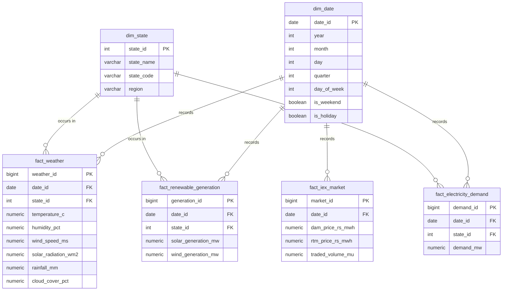

# Database Design: Energy Market Intelligence Platform

This document outlines the Star Schema design for the Energy Market Intelligence Platform, optimized for PostgreSQL. It includes a dimensional model to support analytics and forecasting for renewable energy generation, electricity demand, and the IEX market.

## ER Diagram

---

## Data Dictionary

### Dimension Tables

#### `dim_state`
Stores information about the geographical states (e.g., Rajasthan, Gujarat).

| Column Name | Data Type | Key | Business Definition |
| :--- | :--- | :--- | :--- |
| `state_id` | SERIAL | PK | Unique identifier for the state. |
| `state_name` | VARCHAR(100) | | Full name of the state (e.g., 'Rajasthan'). |
| `state_code` | VARCHAR(10) | | Abbreviation or code for the state (e.g., 'RJ'). |
| `region` | VARCHAR(50) | | Larger geographical region (e.g., 'North', 'West'). |

#### `dim_date`
Stores calendar-related attributes to enable time-series slicing and dicing.

| Column Name | Data Type | Key | Business Definition |
| :--- | :--- | :--- | :--- |
| `date_id` | DATE | PK | The date of the record (YYYY-MM-DD). |
| `year` | INT | | Calendar year. |
| `month` | INT | | Calendar month (1-12). |
| `day` | INT | | Day of the month (1-31). |
| `quarter` | INT | | Calendar quarter (1-4). |
| `day_of_week` | INT | | Day of the week (1=Monday, 7=Sunday). |
| `is_weekend` | BOOLEAN | | Flag indicating if the date falls on a weekend. |
| `is_holiday` | BOOLEAN | | Flag indicating if the date is a public holiday. |

---

### Fact Tables

#### `fact_weather`
Captures daily historical and forecasted weather metrics.

| Column Name | Data Type | Key | Business Definition |
| :--- | :--- | :--- | :--- |
| `weather_id` | BIGSERIAL | PK | Surrogate key for the weather fact record. |
| `date_id` | DATE | FK | Reference to the date dimension. |
| `state_id` | INT | FK | Reference to the state dimension. |
| `temperature_c` | NUMERIC | | Average temperature in Celsius. |
| `humidity_pct` | NUMERIC | | Relative humidity percentage. |
| `wind_speed_ms` | NUMERIC | | Wind speed in meters per second. |
| `solar_radiation_wm2` | NUMERIC | | Solar radiation in Watts per square meter. |
| `rainfall_mm` | NUMERIC | | Daily rainfall in millimeters. |
| `cloud_cover_pct` | NUMERIC | | Cloud cover percentage. |

#### `fact_renewable_generation`
Stores the daily solar and wind power generation.

| Column Name | Data Type | Key | Business Definition |
| :--- | :--- | :--- | :--- |
| `generation_id` | BIGSERIAL | PK | Surrogate key for the generation fact record. |
| `date_id` | DATE | FK | Reference to the date dimension. |
| `state_id` | INT | FK | Reference to the state dimension. |
| `solar_generation_mw` | NUMERIC | | Total solar energy generated in Megawatts (MW). |
| `wind_generation_mw` | NUMERIC | | Total wind energy generated in Megawatts (MW). |

#### `fact_electricity_demand`
Tracks the aggregate electrical demand.

| Column Name | Data Type | Key | Business Definition |
| :--- | :--- | :--- | :--- |
| `demand_id` | BIGSERIAL | PK | Surrogate key for the demand fact record. |
| `date_id` | DATE | FK | Reference to the date dimension. |
| `state_id` | INT | FK | Reference to the state dimension. |
| `demand_mw` | NUMERIC | | Total electricity demand in Megawatts (MW). |

#### `fact_iex_market`
Captures Indian Energy Exchange market metrics at a national level.

| Column Name | Data Type | Key | Business Definition |
| :--- | :--- | :--- | :--- |
| `market_id` | BIGSERIAL | PK | Surrogate key for the market fact record. |
| `date_id` | DATE | FK | Reference to the date dimension. Note: Uniquely 1 per day. |
| `dam_price_rs_mwh` | NUMERIC | | Day Ahead Market (DAM) clearing price in Rs/MWh. |
| `rtm_price_rs_mwh` | NUMERIC | | Real Time Market (RTM) clearing price in Rs/MWh. |
| `traded_volume_mu` | NUMERIC | | Total volume of energy traded in Million Units (MU). |
