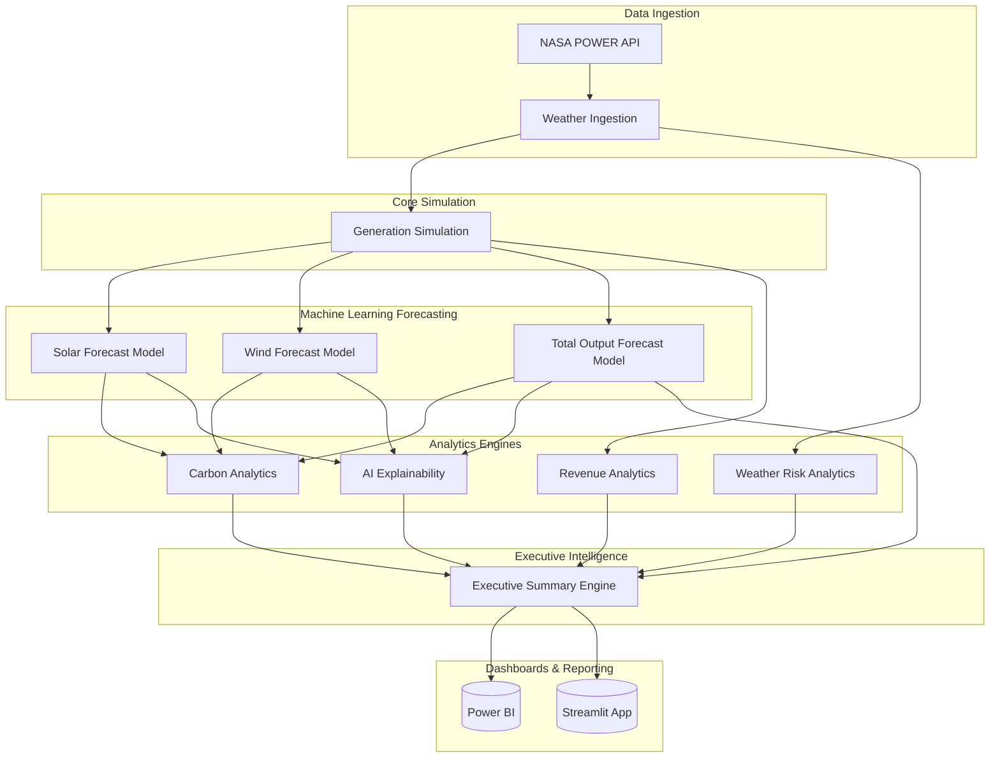
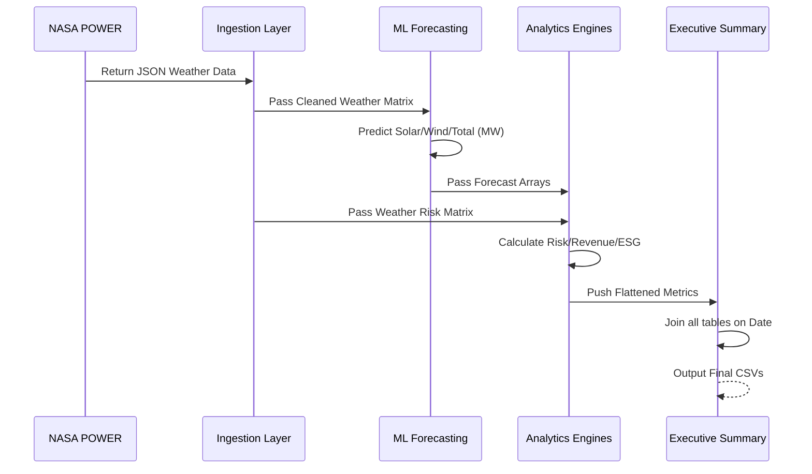

# 🏗️ System Architecture

**Khavda Renewable Energy Digital Twin**

This document outlines the high-level architecture, data flows, and technological foundations of the Renewable Energy Market Intelligence Platform.

---

## 1. System Architecture Diagram

---

## 2. Processing Workflow

1. **Weather Ingestion**: Connects to the NASA POWER API to download historical and current meteorological data (radiation, wind speed, temperature, humidity) for the Khavda coordinates.
2. **Generation Simulation**: Applies physical models and capacity constraints to synthesize ground-truth historical generation data (MW) for solar and wind assets.
3. **Forecasting Models**: XGBoost models predict 24-hour ahead and historical holdout generation values for Solar, Wind, and Total Output.
4. **Carbon Analytics**: Translates forecasted generation into avoided CO₂ emissions, coal saved, and trees equivalent metrics.
5. **Weather Risk Analytics**: Scans meteorological parameters to detect extreme conditions (e.g., Heatwaves, Dust Storms) and triggers alerts.
6. **Revenue Analytics**: Merges generation expectations with financial tariffs and applies revenue-at-risk deductions based on weather severity.
7. **AI Explainability**: Aggregates feature importance across all models to generate plain-text interpretations of AI predictions.
8. **Executive Summary**: A unified pipeline that joins all output tables chronologically into a single, comprehensive management dataset.

---

## 3. Technology Architecture

| Layer | Technology Stack |
| :--- | :--- |
| **Data Ingestion** | `requests`, NASA POWER API |
| **Data Processing** | `pandas`, `numpy` |
| **Machine Learning** | `xgboost`, `scikit-learn` |
| **Visualization (Local)**| `matplotlib`, `seaborn` |
| **Data Storage** | Local File System (CSV) / PostgreSQL *(Planned)* |
| **Business Intelligence**| Power BI *(Planned)*, Streamlit *(Planned)* |
| **Version Control** | Git / GitHub |

---

## 4. Module Interaction Diagram

