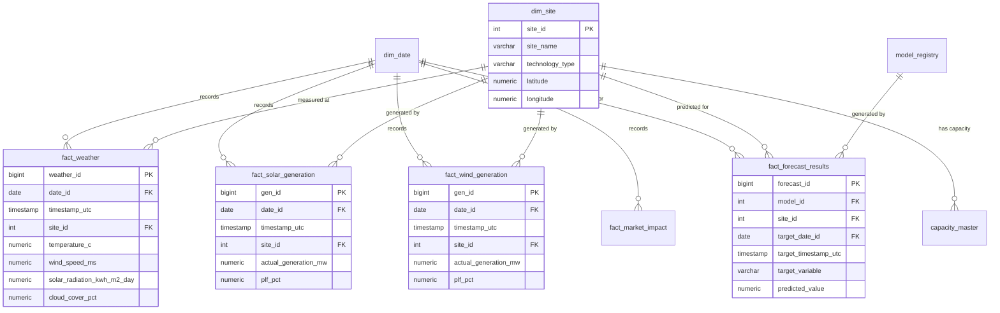

# Section 1: Project Overview

**Title:** AI-Powered Renewable Generation Forecasting and Market Intelligence Platform for Khavda Renewable Energy Park
**Project Focus:** Khavda Renewable Energy Park, Kutch, Gujarat, India

**Context:** The Khavda Renewable Energy Park is a marquee project for Adani Green Energy and one of the largest renewable energy installations globally. This platform pivots from a macro state-level analysis to a hyper-localized, site-specific intelligence system. By exclusively targeting the microclimate and generation dynamics of the Khavda site, the platform will deliver high-precision forecasting for solar and wind generation, predict total site output, and provide actionable market impact analytics. 

---

# Section 2: Business Objectives

1. **Hyper-Local Generation Forecasting:** Provide highly accurate Day-Ahead and Intra-Day forecasts for Solar and Wind generation specifically tuned to Khavda's geographic coordinates.
2. **Total Output Optimization:** Aggregate solar and wind forecasts to predict total grid injection from the Khavda park.
3. **Market Impact Analytics:** Analyze how Khavda's generation profile impacts short-term power markets, specifically looking at correlations with IEX Day-Ahead and Real-Time prices.
4. **Data-Driven Leadership Reporting:** Equip Adani Green Energy leadership with intuitive, automated dashboards (Power BI & Streamlit) to monitor asset performance vs. forecasts and market opportunities.
5. **Operational Scalability:** Build a robust, scalable data engineering architecture capable of handling multi-gigawatt generation data streams.

---

# Section 3: System Architecture

The system transitions to a **Site-Level Data Flow Architecture**:

### 1. Data Flow Pipeline
```mermaid
flowchart LR
    A[Weather Data APIs<br>(NASA POWER, Open-Meteo)] --> B(Data Lake / Raw Storage)
    C[Public Generation & Capacity Data] --> B
    B --> D[Data Warehouse (PostgreSQL)]
    
    D --> E[Solar Gen Forecast Model]
    D --> F[Wind Gen Forecast Model]
    
    E --> G[Total Renewable Output Forecast]
    F --> G
    
    G --> H[Market Impact Analytics]
    H --> I[Power BI Dashboard]
    H --> J[Streamlit App]
```

### 2. Folder Structure Redesign
The previous state-level logic (e.g., `demand_ingestion.py`, `dim_state`) will be deprecated. The new structure will reflect the site-level focus:
```text
energy-market-intelligence-platform/
├── data/
├── notebooks/
├── src/
│   ├── ingestion/
│   │   ├── weather_api.py (Khavda coords)
│   │   ├── capacity_tracker.py
│   │   └── market_data.py
│   ├── forecasting/
│   │   ├── solar_model.py
│   │   ├── wind_model.py
│   │   └── total_output_model.py
│   ├── analytics/
│   │   └── market_impact.py
│   └── utils/
├── database/
├── models/ (registry for XGBoost/Prophet weights)
├── dashboard/ (Streamlit/Power BI templates)
```

---

# Section 4: Database Design

The PostgreSQL database will utilize a Site-Level Star Schema, deprecating the previous `dim_state` and electricity demand tables.

### Dimension Tables
- **`dim_site`**: Master data for specific blocks or phases within Khavda (e.g., Khavda Phase 1 Solar, Khavda Phase 2 Wind).
- **`dim_date`**: Calendar data for time-series analytics.
- **`capacity_master`**: Tracks the rapidly expanding installed capacity (MW) at Khavda over time to normalize generation forecasts (PLF).
- **`model_registry`**: Tracks deployed ML models, their versions, and historical accuracy metrics.

### Fact Tables
- **`fact_weather`**: Hyper-local weather data for Khavda (Temp, Solar Radiation, Wind Speed at hub height).
- **`fact_solar_generation`**: Actual solar output from the site.
- **`fact_wind_generation`**: Actual wind output from the site.
- **`fact_market_impact`**: Market prices (IEX) mapped against Khavda's output periods.
- **`fact_forecast_results`**: Output from the ML pipelines.

---

# Section 5: ER Diagram



---

# Section 6: Data Sources

Given the focus on realistic, freely available data, we will utilize:
1. **Weather (Historical & Forecast):** 
   - *NASA POWER API*: Best for historical solar irradiance and weather profiling.
   - *Open-Meteo API*: Best for real-time and 7-day highly localized weather forecasts.
2. **Generation & Capacity:**
   - Simulated realistic generation data (based on theoretical PLF limits and weather correlations) bounded by public reports on Khavda's phased commissioning.
3. **Market Data:**
   - IEX public reports for DAM/RTM pricing to establish the market impact baseline.

---

# Section 7: Machine Learning Roadmap

The ML approach will shift to site-specific micro-forecasting:

### 1. Solar Generation Forecasting
- **Algorithms:** XGBoost / LightGBM
- **Features:** Solar irradiance, cloud cover, temperature, hour-of-day, installed capacity.
- **Target:** Solar MW Output (or PLF).

### 2. Wind Generation Forecasting
- **Algorithms:** Time-Series models (Prophet for baseline) + Random Forest Regressor.
- **Features:** Wind speed (extrapolated to hub height), wind direction, air density.
- **Target:** Wind MW Output.

### 3. Total Renewable Output Forecasting
- **Logic:** Ensemble or summation model combining Solar and Wind forecasts, capped by current installed capacity and grid evacuation limits.

---

# Section 8: Dashboard Design (Power BI)

The Power BI structure will be tailored for Adani Green Energy Leadership:

1. **Executive Overview:** High-level KPIs: Total current capacity, today's forecasted generation vs. actuals, overall PLF.
2. **Weather Analytics:** Microclimate tracking for Khavda; historical trends vs. current anomalies.
3. **Solar Generation Forecast:** Deep dive into solar performance, daily generation curves (duck curves), irradiance vs. output tracking.
4. **Wind Generation Forecast:** Wind velocity profiles, hub-height performance, diurnal wind patterns.
5. **Total Output Forecast:** Combined Khavda output profile, 7-day forward-looking generation schedule.
6. **Market Impact Analytics:** Overlay of Khavda's generation peaks/troughs against IEX pricing. Analyzing revenue optimization opportunities (e.g., when Khavda peaks during high market price hours).

---

# Section 9: Streamlit Design

The Streamlit app will serve as the interactive data science interface for operational teams.
- **Sidebar:** Date range selector, Model version selector (e.g., XGBoost v1 vs Prophet), Scenario toggles.
- **Main View - "Forecast Control Room":** 
  - Real-time display of the Open-Meteo weather forecast.
  - Interactive Plotly charts showing the next 48 hours of predicted Solar and Wind generation.
  - "What-If" Analysis: Sliders to adjust cloud cover or wind speed and instantly see the impact on predicted MW output.

---

# Section 10: Implementation Roadmap (12 Weeks)

### Phase 1: Foundation (Weeks 1-3)
- **W1:** Redesign project folder structure and deprecate state-level code.
- **W2:** Implement new PostgreSQL Star Schema (dim_site, etc.).
- **W3:** Build and schedule API ingestion pipelines (NASA POWER, Open-Meteo) specifically for Khavda coordinates.

### Phase 2: Data Engineering & Baseline Models (Weeks 4-6)
- **W4:** Develop synthetic/proxy generation data generation logic based on capacity and weather to simulate Khavda output.
- **W5:** Exploratory Data Analysis (EDA) on the Khavda microclimate.
- **W6:** Train baseline ML models (Prophet/Linear Regression) for Solar and Wind.

### Phase 3: Advanced ML & Analytics (Weeks 7-9)
- **W7:** Develop advanced XGBoost/LightGBM models; implement hyperparameter tuning.
- **W8:** Construct the Total Output Forecasting ensemble model.
- **W9:** Integrate IEX market data and build the Market Impact correlation analytical logic.

### Phase 4: Visualization & Deployment (Weeks 10-12)
- **W10:** Develop the interactive Streamlit Application for operational teams.
- **W11:** Design and build the 6-page Power BI Dashboard for Executive Leadership.
- **W12:** End-to-end testing, final documentation, and mock presentation preparation for stakeholders.

---
> [!IMPORTANT]
> **User Review Required:** This architectural pivot completely removes all state-level forecasting (Rajasthan/Gujarat) and demand forecasting. Once you approve this Implementation Plan, I will proceed to restructure the project folders and rewrite the PostgreSQL database schema. Let me know if you would like to adjust the 12-week timeline or dashboard pages!
